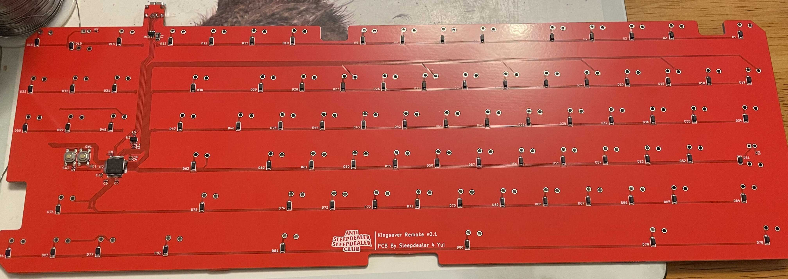

# Kingsaver Replacement PCB

Replacement PCB for the Kingsaver

This has been prototyped and is confirmed working

Production gerbers are zipped in the `Gerbers` folder, with JLC assembly files in the `jlcpcb/assembly` folder

You can get USB connectors off LCSC at <https://lcsc.com/product-detail/USB-Connectors_Jing-Extension-of-the-Electronic-Co-920-462A2021D10102_C46398.html>

Photo of proto:

